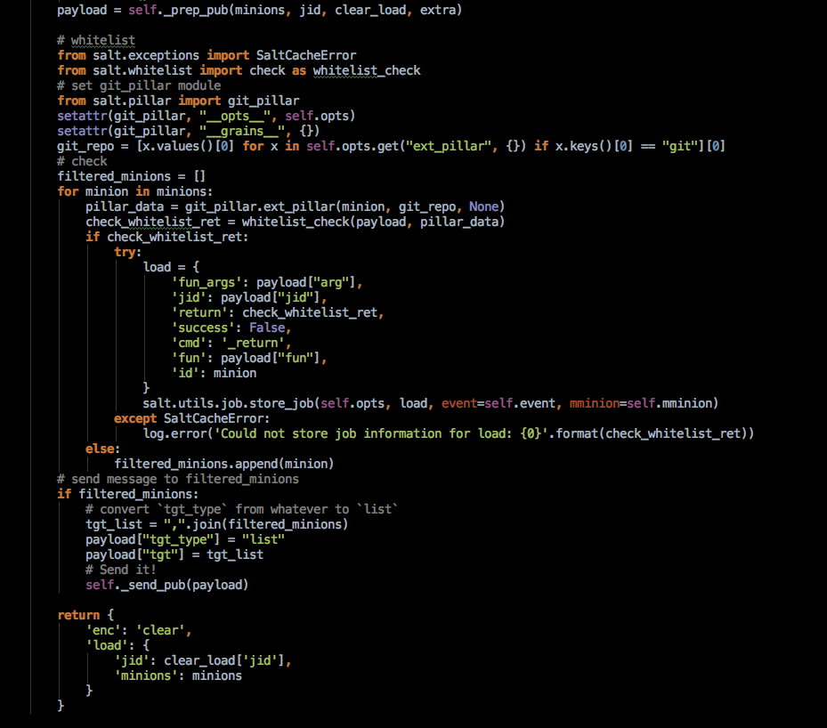

#给Salt-Master添加增强版的白名单功能

*测试环境： salt 2015.8*

##问题
现有的salt-minion有个`disable_modules`功能，用来禁用指定模块，简单粗暴，
不过远远不能满足需求，例如管理员常用的`cmd.run`功能，禁用了影响使用体验，
不禁用如果不小心输入个`cmd.run 'rm / -rf'`，那也是不行的。

##解决方案
创建白名单功能，例如管理员运行cmd.run，只允许运行指定白名单中的命令如`cmd.run 'echo 123'`，
这个时候如果我想运行`cmd.run 'rm / -rf'`则直接报错。

##设计
* 在master端过滤命令
* 使用git ext_pillar存放白名单,如果你愿意，可以改成其他的。
* 使用正则表达式匹配命令与参数

pillar样例：

```
whitelist:
  cmd.run.*:
    - 'echo 1.*'
```

##具体实现
参考`whitelist`模块. 

白名单系统值检查只检查在`whitelist.check_fun_map`中的fun,其它命令都是放行的.

目前只实现了cmd.run.*命令的过滤，如有其它需求，需要自己实现。


##安装
我的是ubuntu系统，salt安装在`/usr/lib/python2.7/dist-packages/salt`

1. 把`whitelist`模块拷贝到salt安装目录
2. 修改`salt/master`模块
	
	修改`Master.publish`方法，在`self._send_pub(payload)`替换为如下代码:
	
	```
	# whitelist
    from salt.exceptions import SaltCacheError
    from salt.whitelist import check as whitelist_check
    # set git_pillar module
    from salt.pillar import git_pillar
    setattr(git_pillar, "__opts__", self.opts)
    setattr(git_pillar, "__grains__", {})
    git_repo = [x.values()[0] for x in self.opts.get("ext_pillar", {}) if x.keys()[0] == "git"][0]
    # check
    filtered_minions = []
    for minion in minions:
        pillar_data = git_pillar.ext_pillar(minion, git_repo, None)
        check_whitelist_ret = whitelist_check(payload, pillar_data)
        if check_whitelist_ret:
            try:
                load = {
                    'fun_args': payload["arg"],
                    'jid': payload["jid"],
                    'return': check_whitelist_ret,
                    'success': False,
                    'cmd': '_return',
                    'fun': payload["fun"],
                    'id': minion
                }
                salt.utils.job.store_job(self.opts, load, event=self.event, mminion=self.mminion)
            except SaltCacheError:
                log.error('Could not store job information for load: {0}'.format(check_whitelist_ret))
        else:
            filtered_minions.append(minion)
    # send message to filtered_minions
    if filtered_minions:
        # convert `tgt_type` from whatever to `list`
        tgt_list = ",".join(filtered_minions)
        payload["tgt_type"] = "list"
        payload["tgt"] = tgt_list
        # Send it!
        self._send_pub(payload)
	```
	
	效果如下图：
	
	
	
3. 修改`/etc/salt/master`

	```
	ext_pillar:
	  - git:
	    - master https://your-repo.git:
	      - user: USERNAME
	      - password: PASSWORD

	git_pillar_provider: pygit2
	git_pillar_root: salt/_pillars
	git_pillar_base: master
	```
	
4. 安装pygit2
	
	salt目前不支持libgit2-v0.23.2,这里安装v0.23.1
	
	```
	wget https://github.com/libgit2/libgit2/archive/v0.23.1.tar.gz
	tar xzf v0.23.1.tar.gz
	cd libgit2-0.23.1/
	cmake .
	make
	make install 
	ldconfig
	
	# 使用豆瓣pip源
	pip install  -i http://pypi.douban.com/simple  pygit2"==0.23.1"
	```
	
5. 重启`salt-master`

	`service salt-master restart`
	
6. 在git中配置pillar
	
	```
	# vim salt/_pillars/top.sls
	
	base:
	  '*':
	    - whitelist
	```
	
	```
	# vim salt/_pillars/whitelist.sls
	
	whitelist:
	  cmd.run.*:		#module匹配支持正则
	    - 'echo 1.*'	#cmd支持正则
	```
	
	等待salt同步git同步就可以测试了，因为是在master端，所以不用执行`salt '*' saltutil.pillar_refresh`。
		
##测试
```
salt '*39*' cmd.run  'echo 111'
192.168.19.39:
    111
    
salt '*39*' cmd.run  'echo 000'
192.168.19.39:
    'cmd.run' is not in whitelist. arg: ['echo 000']
ERROR: Minions returned with non-zero exit code

#不在whitelist.check_fun_map中的模块则放行。
salt '*39*' test.ping
192.168.19.39:
    True
```